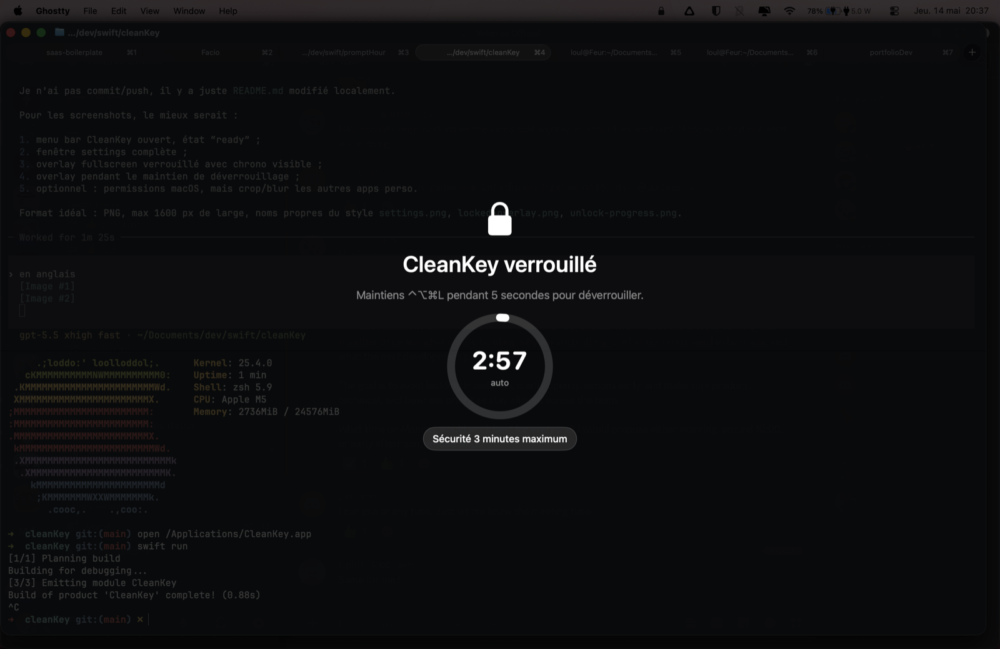
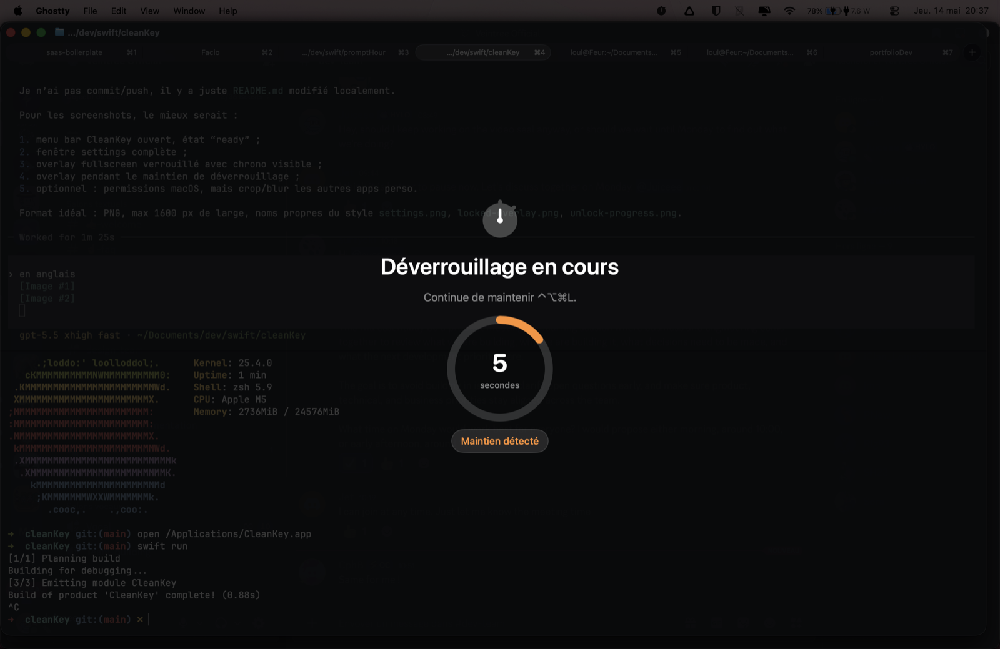

# CleanKey

[](https://github.com/Juiiceee/cleanKey/actions/workflows/ci.yml)
[](https://github.com/Juiiceee/cleanKey/actions/workflows/release-please.yml)
[](https://github.com/Juiiceee/cleanKey/releases)
[](LICENSE)

CleanKey is a lightweight macOS menu bar app that temporarily blocks keyboard, mouse and trackpad input so you can clean your keyboard without triggering shortcuts, clicks or accidental text input.

The app is designed around one important rule: **you should never be trapped**. CleanKey includes a hold-to-unlock shortcut, a visible fullscreen countdown, permission monitoring, single-instance protection and an automatic safety unlock.

## Preview

| Locked overlay | Unlock progress |
| --- | --- |
|  |  |

## Features

- Global shortcut to lock all input.
- Hold the same shortcut for the configured timer duration to unlock.
- Fullscreen overlay with remaining time and unlock progress.
- Automatic unlock after 3 minutes maximum.
- 1-second post-unlock guard to avoid accidental shortcut fallout.
- Menu bar status icon that changes with the current state.
- Settings window for shortcut, launch at login, permissions, version and source link.
- Launch at login support through macOS `SMAppService`.
- Permission monitoring: if Accessibility is revoked while the app is running, CleanKey stops interception and unlocks.
- Single-instance guard to avoid running the installed app and a development build at the same time.
- GitHub Actions CI, `release-please`, ZIP and DMG release artifacts.

## Requirements

- macOS 13 Ventura or newer.
- Accessibility permission.
- Input Monitoring permission may also be required depending on the macOS version and local privacy settings.

CleanKey uses a macOS event tap through Core Graphics. That is why the app needs system privacy permissions before it can intercept and block input.

## Quick Start

1. Download the latest `CleanKey.dmg` from the [GitHub Releases](https://github.com/Juiiceee/cleanKey/releases) page.
2. Open the DMG.
3. Drag `CleanKey.app` into `Applications`.
4. Launch CleanKey.
5. Allow CleanKey in:
   - System Settings -> Privacy & Security -> Accessibility
   - System Settings -> Privacy & Security -> Input Monitoring, if macOS asks for it
6. Use the menu bar icon to open settings or lock immediately.

Default shortcut:

```text
Control + Option + Command + L
```

## Development

Debug builds skip macOS permission checks by default so `swift run` can exercise the menu bar app, global shortcut and lock overlay without granting Accessibility permission. In this mode, CleanKey shows a development preview overlay and does not block real keyboard, mouse or trackpad input.

To test the real event tap and permission flow from a debug build:

```sh
CLEANKEY_SKIP_PERMISSIONS=0 swift run
```

## How It Works

Press the configured shortcut once to lock input. CleanKey shows a fullscreen overlay and starts a 3-minute safety timer.

To unlock manually, press the same shortcut again and keep holding it for the configured timer duration. The default is 2 seconds, and the overlay shows the hold progress so you know exactly when the unlock is about to complete.

If the shortcut fails, if permissions change, or if something unexpected happens, CleanKey is designed to recover:

- the app auto-unlocks after 3 minutes;
- removing Accessibility permission forces CleanKey to stop input interception;
- closing the app calls a cleanup path that unlocks and stops the event tap;
- only one CleanKey instance can run at a time.

## Settings

Open the CleanKey menu bar icon to access:

- current lock status;
- configured shortcut;
- manual lock action;
- settings window;
- permission shortcuts;
- quit action.

The settings window lets you:

- change the global shortcut;
- choose the hold-to-unlock timer duration;
- enable or disable launch at login;
- verify permissions;
- open Accessibility and Input Monitoring settings;
- view the app version;
- open the source code repository.

## macOS Permissions

CleanKey needs Accessibility permission to control and intercept input events. On some systems, Input Monitoring is also needed because the app observes keyboard input while other apps are active.

If CleanKey says permissions are missing even though the switches look enabled:

1. Quit CleanKey from the menu bar.
2. Turn CleanKey off in Accessibility and Input Monitoring.
3. Remove CleanKey from both permission lists if macOS allows it.
4. Launch `/Applications/CleanKey.app` again.
5. Add or re-enable CleanKey in both permission panes.
6. Click "Verify" in CleanKey settings.

This can happen after replacing the app bundle, running a development build with `swift run`, or downloading a new unsigned/ad-hoc signed build. macOS privacy permissions are tied to the app identity and code signature, so replacing the app can require refreshing permissions.

## Gatekeeper Warning

If macOS says:

```text
"CleanKey.app" is damaged and cannot be opened.
```

that usually means the downloaded build is not notarized with an Apple Developer ID certificate yet. The long-term fix is to publish signed and notarized releases.

For local testing only, after copying the app to `Applications`, you can remove the quarantine attribute:

```bash
xattr -dr com.apple.quarantine /Applications/CleanKey.app
open /Applications/CleanKey.app
```

Do not run that command for apps you do not trust.

## Uninstall

1. Open CleanKey settings and disable launch at login.
2. Quit CleanKey from the menu bar.
3. Delete `CleanKey.app` from `Applications`.
4. Remove CleanKey from:
   - System Settings -> Privacy & Security -> Accessibility
   - System Settings -> Privacy & Security -> Input Monitoring
5. Optionally remove saved settings:

```bash
defaults delete dev.loul.CleanKey
```

## Build From Source

Clone the repository:

```bash
git clone git@github.com:Juiiceee/cleanKey.git
cd cleanKey
```

Build the app:

```bash
swift build -c release --product CleanKey
```

Run the development build:

```bash
swift run
```

Package the `.app`, `.zip` and `.dmg`:

```bash
./scripts/package_app.sh
```

Generated files:

```text
.build/app/CleanKey.app
.build/app/CleanKey.zip
.build/app/CleanKey.dmg
```

Run tests:

```bash
swift test
```

## Development Notes

CleanKey is built with:

- Swift Package Manager;
- AppKit and SwiftUI;
- Core Graphics event taps;
- `SMAppService` for launch at login;
- GitHub Actions for CI and release packaging;
- `release-please` for changelog and semantic releases.

Useful commands:

```bash
make build
make test
make package
make clean
```

When testing locally, avoid running multiple builds at the same time. The app now has a single-instance guard, but the safest workflow is still to quit the installed app before using `swift run`.

## Releases

Releases are managed by `release-please`.

Use Conventional Commits:

```text
feat: add a user-facing feature
fix: fix a user-facing bug
chore: update tooling or maintenance files
docs: update documentation
```

When release-please opens and merges a release PR, the release workflow:

- updates `CHANGELOG.md`;
- updates `version.txt`;
- creates the GitHub Release;
- builds `CleanKey.app`;
- uploads `CleanKey.dmg` and `CleanKey.zip` as release assets.

Required GitHub repository settings:

- Settings -> Actions -> General -> Workflow permissions -> Read and write permissions.
- Settings -> Actions -> General -> Allow GitHub Actions to create and approve pull requests.

Optional secret for release-please PR-triggered workflows:

- `RELEASE_PLEASE_TOKEN`: a PAT with repository access. If missing, the workflow falls back to `GITHUB_TOKEN`.

## Signing And Notarization

Without Apple Developer signing and notarization, public downloads may trigger Gatekeeper warnings. To publish cleaner macOS releases, configure these repository secrets:

- `APPLE_CERTIFICATE_BASE64`: Developer ID Application `.p12` certificate encoded in base64.
- `APPLE_CERTIFICATE_PASSWORD`: password for the `.p12` certificate.
- `APPLE_CERTIFICATE_NAME`: exact signing identity name, optional when the certificate contains a single Developer ID Application identity.
- `KEYCHAIN_PASSWORD`: temporary CI keychain password, optional.
- `APPLE_ID`: Apple Developer account email.
- `APPLE_TEAM_ID`: Apple Developer Team ID.
- `APPLE_APP_SPECIFIC_PASSWORD`: app-specific password for `notarytool`.

When those secrets are present, the release workflow signs the app, signs the DMG and attempts notarization.

## Project Structure

```text
Sources/CleanKeyCore/       Shared shortcut and settings logic
Sources/CleanKey/           macOS app, menu bar, permissions, event tap and overlay
Tests/                      Unit tests for core logic
Packaging/                  Info.plist and app icon
scripts/package_app.sh      App, ZIP and DMG packaging
scripts/notarize_dmg.sh     Apple notarization helper
.github/workflows/          CI and release automation
```

## Contributing

Issues and pull requests are welcome.

For code changes:

- keep the app safe to recover from, especially around input blocking;
- prefer small, focused pull requests;
- run `swift build` and `swift test` when possible;
- use Conventional Commits so release-please can generate clean releases.

## Additional Screenshots

- menu bar dropdown while CleanKey is ready;
- settings window showing shortcut, permissions and launch at login;
- macOS permission panes for Accessibility and Input Monitoring.

## License

CleanKey is released under the [MIT License](LICENSE).
